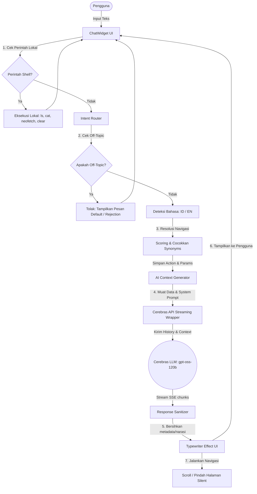

# Laporan Analisis Sistem AI Asisten Portofolio

Laporan ini menyajikan analisis mendalam mengenai arsitektur, komponen, dan alur eksekusi sistem Kecerdasan Buatan (AI) yang diintegrasikan ke dalam proyek **Motionfolio**. Laporan ini disusun untuk membantu Anda memahami cara kerja sistem saat ini dan bagaimana mengimplementasikan sistem serupa untuk kebutuhan Anda.

---

## 1. Gambaran Umum Arsitektur (Architecture Overview)

Sistem AI pada proyek ini dirancang sebagai **AI Assistant & Terminal Emulator hybrid**. Sistem ini menggabungkan model bahasa besar (LLM) untuk interaksi percakapan dengan router berbasis aturan (rule-based router) untuk mendeteksi intent navigasi secara deterministik tanpa memerlukan model klasifikasi eksternal.

Berikut adalah diagram arsitektur alur data dari input pengguna hingga output respons:



---

## 2. Analisis Komponen Utama (Core Components)

Sistem AI ini terbagi menjadi lima komponen utama yang terpisah secara modular:

### A. Antarmuka Pengguna (ChatWidget UI)
*   **Berkas Utama**: `src/components/ChatWidget.jsx` & `src/components/ChatLauncher.jsx`
*   **Fungsi**: 
    *   Menampilkan antarmuka bergaya terminal shell (`HERI_bot - -bash`) yang interaktif.
    *   Mendukung shortcut keyboard (seperti `Ctrl + K` untuk buka/tutup, `Esc` untuk menutup, `Arrow Up/Down` untuk melihat riwayat perintah).
    *   Menyediakan tombol aksi cepat (*quick action buttons*) seperti `./stack`, `./projects`, `./experience`, `./contact` untuk mempermudah navigasi bagi pengguna awam.
    *   Menangani efek mengetik (*typewriter animation*) pada teks keluaran dan menangani penyalinan teks ke papan klip (*copy to clipboard*).

### B. Intent Router & Deteksi Topik (IntentRouter)
*   **Berkas Utama**: `src/services/intentRouter.js`
*   **Fungsi**:
    *   **Penyaring Topik (Off-Topic Filter)**: Menggunakan pola regex (`OFF_TOPIC_PATTERNS`) untuk menyaring pesan di luar konteks portofolio (seperti pertanyaan matematika umum, pemrograman skrip, cuaca, dll.) sebelum melakukan panggilan API LLM. Hal ini menghemat biaya kuota/token API.
    *   **Pengecualian Whitelist (`ON_TOPIC_OVERRIDES`)**: Mengizinkan kata-kata kunci tertentu (nama proyek, slug, dll.) agar tetap lolos meskipun memicu deteksi off-topic.
    *   **Sistem Penilaian Kecocokan (Scoring System)**: Mencocokkan input pengguna dengan sinonim navigasi bagian situs (*section*) atau proyek tertentu. Menghitung skor berdasarkan kemunculan kata kunci dan panjang sinonim (kemunculan multi-kata mendapat bobot ekstra).
    *   **Deteksi Bahasa**: Menggunakan fungsi heuristik berdasarkan kata penanda (*marker words*) bahasa Indonesia untuk menentukan apakah pengguna berbicara dalam bahasa Indonesia atau Inggris.

### C. Pembuat Konteks & Serialisasi Data (AI Context & Prompt Builder)
*   **Berkas Utama**: `src/services/aiContext.js`
*   **Fungsi**:
    *   Mengonversi data statis portofolio (`portfolioData.js` dan `projectDetailsData.js`) menjadi format daftar (*bullet list*) teks yang ringkas agar mudah dipahami oleh LLM.
    *   **System Prompt Generator**: Menyusun prompt sistem terstruktur yang mendefinisikan kepribadian AI (berperan sebagai pemilik portofolio, berbicara dengan sudut pandang orang pertama "saya/aku/gue"), batasan panjang jawaban (maksimum 80 kata atau 3 bullet point), dan kecocokan bahasa.
    *   **Context Stuffing Terarah (Scoped Context)**: Mempersempit data dengan hanya menyisipkan konteks proyek yang paling relevan dengan kueri pengguna (menggunakan skema *scoring relevance* sederhana), sehingga mengurangi konsumsi token.

### D. Wrapper Koneksi LLM (Cerebras API Integration)
*   **Berkas Utama**: `src/services/cerebras.js`
*   **Fungsi**:
    *   Mengintregasikan API **Cerebras** menggunakan endpoint kompatibel OpenAI (`/v1/chat/completions`).
    *   Menggunakan model `gpt-oss-120b` dengan parameter `temperature: 0.35` (menjaga respons agar tetap konsisten dan tidak berhalusinasi) dan `stream: true`.
    *   Mengimplementasikan fungsi generator asinkron (`async function* parseOpenAICompatibleStream`) untuk membaca dan mem-parsing data SSE (Server-Sent Events) secara langsung dari peramban, memberikan pengalaman pengetikan respons yang sangat lancar (*real-time streaming*).

### E. Pembersih Respons (Response Sanitizer)
*   **Berkas Utama**: `src/services/responseSanitizer.js`
*   **Fungsi**:
    *   Menghilangkan blok kode JSON atau metadata aksi navigasi yang tidak sengaja terketik oleh model.
    *   Menyaring kalimat narasi navigasi peramban (misalnya: *"Saya akan membuka proyek..."*, *"Navigating to..."*). Hal ini penting agar eksekusi navigasi terasa seperti otomatisasi gaib tanpa perlu AI mengeja langkah UI-nya di obrolan.

---

## 3. Alur Detil Jalannya Program (Execution Workflow)

Setiap kali pengguna menekan tombol *Enter* atau mengirim pesan, sistem melakukan langkah-langkah berikut:

1.  **Pengecekan Perintah Shell**: Aplikasi memeriksa apakah input adalah perintah terminal lokal seperti `ls`, `clear`, atau `neofetch`. Jika ya, sistem langsung mengeksekusinya di sisi klien (tanpa API).
2.  **Filter Off-Topic**: Menguji apakah input keluar dari cakupan (misal: "tolong tuliskan kode python untuk kalkulator"). Jika di luar cakupan, AI akan langsung menjawab dengan templat penolakan sopan.
3.  **Resolusi Intent Navigasi**: Secara paralel, `intentRouter` menganalisis apakah pengguna berniat membuka proyek atau berpindah ke bagian tertentu (misal: "buka proyek leadsup"). Jika terdeteksi, aksi ini disimpan dalam variabel sementara.
4.  **Panggilan API Streaming**: API Wrapper memanggil Cerebras dengan mengirimkan *System Prompt*, *Scoped Context*, riwayat percakapan (maksimal 6 pesan terakhir), dan pesan pengguna.
5.  **Sanitasi & Penayangan Streaming**: Data stream dibaca potongan demi potongan, dibersihkan lewat `responseSanitizer`, lalu dikirim ke efek *typewriter* untuk ditampilkan di layar.
6.  **Eksekusi Aksi Navigasi Silen**: Setelah respons selesai diketik sepenuhnya, jika ada aksi navigasi yang tersimpan di langkah 3, aplikasi akan memanggil `window.lenisInstance.scrollTo` atau React Router `navigate` untuk menggeser posisi halaman atau membuka modal secara mulus.

---

## 4. Kelemahan & Rekomendasi Keamanan Produksi

> [!WARNING]
> **Peringatan Keamanan Kunci API di Sisi Klien (Client-Side API Key Exposure)**
> Pada berkas `src/services/cerebras.js`, API Key dimuat menggunakan variabel lingkungan Vite (`VITE_CEREBRAS_API_KEY`). Vite menyuntikkan variabel ini langsung ke dalam bundel JavaScript klien saat kompilasi produksi (*build time*). 
> Hal ini menyebabkan kunci API Anda dapat dibaca dengan mudah oleh siapa saja melalui DevTools peramban atau dengan memeriksa berkas JS yang diunduh.

### Rekomendasi Perbaikan untuk Produksi:
Untuk membuat AI serupa yang aman dan skalabel untuk rilis publik, Anda wajib merancang sistem dengan arsitektur **Proxy API**:

```
[ Frontend (ChatWidget) ] <---> [ Server / Serverless Backend (Node.js/Next.js API) ] <---> [ Cerebras / OpenAI API ]
```

1.  **Sembunyikan API Key**: Simpan API Key sebagai *Environment Secret* di server backend Anda (Vercel, Netlify, Express, dll.) yang tidak dapat diakses dari peramban.
2.  **Buat API Endpoint Khusus**: Frontend hanya mengirimkan pesan ke endpoint lokal Anda (contoh: `POST /api/chat`).
3.  **Implementasikan Rate Limiting**: Batasi jumlah panggilan per menit berdasarkan alamat IP pengguna di server backend guna mencegah penyalahgunaan kuota API Anda.

---

## 5. Panduan Implementasi: Cara Membuat AI Serupa

Jika Anda ingin membangun AI asisten serupa untuk proyek Anda yang lain, berikut adalah langkah-langkah praktisnya:

### Langkah 1: Siapkan Data Kontekstual Anda
Buat sebuah objek JavaScript yang rapi berisi seluruh data yang ingin Anda ajarkan pada AI (bio, portofolio, daftar layanan, dll.). Pisahkan data ini dari komponen UI agar tidak membebani performa pemuatan halaman awal.

### Langkah 2: Buat Intent Router Deterministik (Tanpa Model Tambahan)
Gunakan pendekatan ekspresi reguler (Regex) untuk mencocokkan kata kunci tindakan navigasi seperti `buka`, `pergi ke`, `tampilkan` ditambah sinonim halaman Anda. Ini jauh lebih cepat dan 100% gratis dibandingkan memanggil LLM atau model klasifikasi terpisah (seperti BERT/NLU) hanya untuk sekadar mendeteksi tombol klik.

### Langkah 3: Integrasikan Panggilan LLM Streaming
Gunakan fungsi `fetch` bawaan peramban dengan memanfaatkan pembaca aliran (`response.body.getReader()`) seperti di berkas `cerebras.js` untuk mendapatkan respons karakter-demi-karakter. Hal ini meningkatkan kenyamanan pengguna secara drastis dibanding menunggu respons lengkap dari API yang membutuhkan waktu 3-5 detik.

### Langkah 4: Terapkan Pembatasan Konteks (Context Window Management)
Jangan mengirimkan seluruh data riwayat obrolan dari awal sesi ke LLM. Cukup kirim **5-8 pesan terakhir** (gunakan `.slice(-6)` seperti pada sistem saat ini) ditambah ringkasan data kontekstual yang relevan dengan pertanyaan saja untuk menghemat token dan menjaga kecepatan respons tetap stabil.
